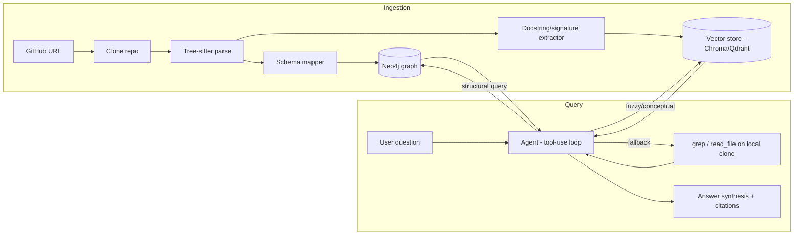

# Architecture & Design Document

**Project:** CodeGraph — Graph-Augmented Codebase Q&A
**Companion doc:** [PRD.md](./PRD.md)
**Status:** Draft v2 — scoped to Python only
**Last updated:** 2026-08-24

---

## 1. System Overview

Two independent pipelines share the same cloned repo: **ingestion** (build-time, once per repo) and **query** (runtime, per question). The agent in the query pipeline chooses which retrieval tool(s) to use per question rather than a hardcoded router.

## 2. Component Breakdown

### 2.1 Ingestion Service
- **Input:** public GitHub URL.
- **Steps:**
  1. Shallow clone to local disk (or temp storage in deployed mode).
  2. Walk files matching supported languages (`.py` only for MVP).
  3. Parse each file with the appropriate tree-sitter grammar into an AST.
  4. Run the **schema mapper** (language-specific visitor) that walks each AST and emits graph nodes/edges per the unified schema (Section 3).
  5. Bulk-load nodes/edges into Neo4j (batched `UNWIND` Cypher writes, not one query per node).
  6. In parallel, extract function/class signatures + docstrings and embed them into the vector store, keyed by the same node IDs used in the graph — this is what lets a vector hit be "expanded" into its graph neighborhood later.
- **Idempotency:** node IDs are deterministic (e.g., hash of `repo + file_path + qualified_name`), so re-ingesting the same commit overwrites rather than duplicates.

### 2.2 Graph Store (Neo4j)
- Single database per ingested repo (or a `repo_id` property partitioning a shared instance — start with one DB per repo for simplicity, revisit if managing many repos becomes a real need).
- Schema is enforced at the application layer (the schema mapper), not via Neo4j constraints beyond basic uniqueness on node IDs.

### 2.3 Vector Store (Chroma or Qdrant)
- Stores embeddings of **function/class-level summaries** (signature + docstring + optionally an LLM-generated one-line description), not raw chunked source — raw-code embeddings are consistently weaker for semantic retrieval than natural-language descriptions of what the code does.
- Each vector record carries the graph node ID as metadata, so a vector hit can pull the full graph context (callers, callees, containing class) via a follow-up graph query.

### 2.4 Query Agent
- LLM-driven tool-use loop (Claude via Anthropic API) with three tools:
  1. `graph_query(cypher)` — executes a read-only Cypher query against Neo4j. The agent is prompted with the schema + few-shot examples to generate this; queries are validated (read-only, syntactically checked) before execution.
  2. `semantic_search(query)` — embeds the query, returns top-k vector hits with their graph node IDs, then auto-expands each into its immediate graph neighborhood.
  3. `grep_and_read(pattern | file_path)` — last-resort raw text search / file read on the local clone, for anything the structured layers can't resolve.
- The agent iterates: pick a tool, inspect the result, decide whether it has enough to answer or needs another hop (e.g., "who calls this?" → graph query → "and what does *that* function do?" → another graph query or grep).
- **Transparency requirement (from PRD NFRs):** every tool call and its raw result is logged and surfaced in the UI, not hidden — this is a feature, not debug noise, since it's the evidence that retrieval is grounded rather than hallucinated.

### 2.5 Answer Synthesis
- Once the agent has enough context, a final LLM call composes the answer, required to cite `file:line` for every factual claim, sourced from the graph node properties (`file_path`, `start_line`, `end_line`) captured at ingestion time.

### 2.6 Evaluation Harness
- Separate from the runtime system — a CLI/script, not a UI feature.
- **Ground truth set:** ~20-30 hand-written Q&A pairs across 2-3 real public repos, covering both structural questions (best case for the graph) and conceptual questions (best case for vector search), so the eval doesn't just flatter one retrieval mode.
- **Baseline:** a minimal naive-RAG implementation (fixed-size chunking + embedding + top-k similarity + LLM answer) built once, purely as the comparison point — not maintained further.
- **Metrics:** retrieval precision/recall against the ground-truth answer's actual source location(s), plus a pass/fail on final answer correctness (LLM-graded or manually graded for the small set size).
- **Output:** a results table (per-question and aggregate) checked into the repo and summarized in the README.

## 3. Graph Schema (MVP)

### Node types

| Node | Key properties |
|------|-----------------|
| `File` | path, language |
| `Module` | qualified_name, file path |
| `Class` | name, qualified_name, file_path, start_line, end_line |
| `Function` | name, qualified_name, file_path, start_line, end_line, signature |
| `Method` | name, qualified_name, file_path, start_line, end_line, signature |
| `Import` | source_module, imported_name, alias |

### Relationship types

| Relationship | Meaning |
|---------------|---------|
| `CONTAINS` | File→Module, Module→Class/Function |
| `DEFINES` | Class→Method |
| `CALLS` | Function/Method→Function/Method |
| `IMPORTS` | Module→Import, Import→(external or internal Module) |
| `INHERITS` | Class→Class |
| `REFERENCES` | Function/Method→Class (e.g., type hints, instantiation) |

This is deliberately a subset of code-graph-rag's 20 node / 23 edge schema — enough to answer real structural questions (who calls this, what inherits from what, what does this import) without the maintenance cost of a much larger schema. Extending it (e.g., adding `Interface`, `Enum`, data-flow edges) is a natural, well-scoped follow-up once MVP is proven.

### Module naming

Modules are keyed by the name they are *imported* by, not their path on disk. The
package root is the outermost unbroken run of directories containing
`__init__.py`, so `src/requests/api.py` becomes `requests.api`, not
`src.requests.api`. This matters for Phase 2: an LLM asked about a codebase will
write `requests.sessions.Session`, and the graph has to answer to that name.

### Resolution: what works, and what does not

Measured on real repositories (`psf/requests`, `pallets/click`), the resolver
links 70-83% of call sites that point at repository-internal code. References
that provably point outside the repo (imports that resolve to no internal
module, builtins) and attribute calls on values with no inferable type are
counted separately rather than folded into the miss rate — otherwise the number
would mostly measure how much stdlib a project uses.

Resolved: plain calls via local/imported/unique-name lookup, `self.`/`cls.`
calls (respecting overrides), `super().` calls against base classes, calls on
variables assigned from a constructor, calls on parameters with a class
annotation, calls on imported internal modules, inner functions calling their
siblings, and imports guarded by `if TYPE_CHECKING:` or `try/except ImportError`.

Not resolved, by design or by known limitation:

* Receivers whose type comes from a **method return value** — `adapter =
  self.get_adapter(url); adapter.send(...)` does not link, because return-type
  inference across calls is not implemented. This is the largest remaining gap.
* Module-level **variable aliases** (`preferred_clock = time.perf_counter`) —
  only `def`/`class` statements become nodes.
* Names **re-exported from an internal module but originating in the stdlib**
  (`from .compat import urlparse`) correctly produce no edge, since the target
  has no node.
* Dynamic dispatch, `getattr`, monkey-patching, and star-imports.
* Attribute chains on `self` (`self._thread_local.chal.get(...)`).

The unique-name fallback links a call only when exactly one candidate exists
repository-wide, trading recall for precision. Phase 5 measures whether that
trade is the right one.

### Language-agnostic mapping strategy

The schema deliberately contains nothing Python-specific: `Class`, `Function`,
`Method`, `CALLS`, `INHERITS` and the rest describe constructs that most
languages share. A language is added by writing a tree-sitter grammar binding
plus a thin visitor that maps its AST node types onto this schema — Python's
`class_definition` and TypeScript's `class_declaration` would both emit a
`Class` node with the same property set — without changing the schema itself.

**Only Python is implemented.** The separation is real in the code (`languages.py`
holds the grammar registry, `python_mapper.py` holds all Python-specific
knowledge, and `resolver.py` works on the language-neutral pending-reference
records), but it has not been validated against a second language. Treat
language-agnosticism as a design intent, not a proven claim.

## 4. Tech Stack

| Layer | Choice | Why |
|-------|--------|-----|
| Parsing | tree-sitter (`tree-sitter-python`) | Language-agnostic ASTs, fast, incremental-parse capable for future incremental indexing. Only the Python grammar is wired up. |
| Graph DB | Neo4j (Community, via Docker) | Industry-recognized, Cypher, Neo4j Browser gives free visualization for demo material. |
| Vector store | Chroma (dev) / Qdrant (if hosted demo) | Simple local dev story; Qdrant if a hosted stretch demo is built. |
| LLM | Claude (Anthropic API) | Tool use / agentic loop support, strong code understanding. |
| Backend | Python, FastAPI | Matches tree-sitter/Python ecosystem, easy to expose as an API. |
| Frontend | Streamlit (MVP) → minimal React chat UI (stretch) | Streamlit gets a working demo fast; upgrade only if time allows and UI polish matters for the portfolio presentation. |
| Deployment | Docker Compose (Neo4j + backend + vector store) | One-command local setup for reviewers, per PRD NFR. |
| CI | GitHub Actions | Run eval harness on push as a regression check. |

## 5. Data Flow Detail

### Ingestion sequence
1. `POST /ingest {repo_url}` → clone → parse → schema-map → bulk write to Neo4j → embed + write to vector store → return `repo_id` + ingestion summary (node/edge counts per type).

### Query sequence
1. `POST /query {repo_id, question}` → agent loop starts with question + schema reference in system prompt.
2. Agent selects a tool, executes it against the ingested repo's graph/vector store/local clone.
3. Loop continues until the agent signals it has sufficient context (or hits a max-hop limit — needed as a safety bound, not just an optimization).
4. Synthesis call produces the final cited answer.
5. Response includes: answer text, citations, and the full tool-call trace (for the transparency requirement).

## 6. Deployment Architecture

- **Local (default):** `docker-compose up` starts Neo4j + Chroma + FastAPI backend; Streamlit runs separately (`streamlit run`) or is added to the compose file.
- **Hosted demo (stretch):** Neo4j AuraDB free tier + backend deployed on a free-tier host (e.g., Render/Fly.io) + Chroma or Qdrant Cloud free tier. Sized for occasional recruiter spot-checks, not sustained load — explicitly out of scope to engineer for scale.

## 7. Key Design Decisions & Rationale

| Decision | Alternative considered | Why this choice |
|----------|------------------------|------------------|
| Graph-first retrieval, vector as fallback | Pure vector RAG | Graph fixes exactly the class of question (relational, multi-hop) that vector RAG is weakest on — this is the project's whole thesis. |
| Neo4j over Kùzu | Kùzu (embedded, zero-ops) | CV recognizability outweighs the marginal deployment friction; mitigated via Docker Compose. |
| Agentic multi-hop over single-shot retrieval | One retrieval pass then answer | Real questions about code are often relational chains; single-shot retrieval can't follow them. Also the more defensible "this isn't just RAG" story. |
| Python only at MVP | Match code-graph-rag's 13, or the 2 originally planned here | Depth and a working eval story beat shallow breadth for a portfolio piece. The cost is real and worth stating plainly: the schema's language-agnosticism is now a *design property backed by argument*, not one demonstrated by a second implementation. Adding a language remains a well-scoped extension. |
| Embed summaries, not raw code chunks | Embed raw code | Natural-language descriptions retrieve better against natural-language queries; established technique, not speculative. |
| Skip eBPF/runtime tracing | Match code-graph-rag | High implementation cost, not central to proving the graph-vs-vector thesis; explicitly deferred in the PRD. |

## 8. Open Technical Risks

- Tree-sitter query complexity for accurately resolving `CALLS` edges in a dynamic language (Python's dynamic dispatch, monkey-patching, `getattr`) — likely the hardest correctness problem in the project; scope the eval harness to be honest about known gaps here rather than overclaiming recall. **Phase 1 update:** confirmed as the main source of missed edges; see "Resolution: what works, and what does not" above for the measured breakdown. Return-value type inference is the highest-value remaining improvement.
- Cypher generation reliability from the LLM — mitigate with strict schema-grounded prompting, few-shot examples, and validation before execution; track failure rate as part of the eval harness, not just success cases.
