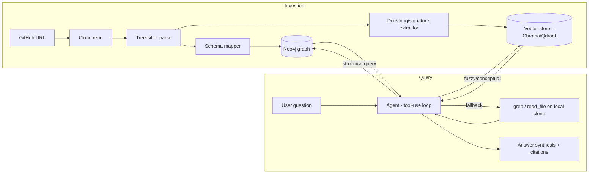

# Architecture & Design Document

**Project:** CodeGraph — Graph-Augmented Codebase Q&A
**Companion doc:** [PRD.md](./PRD.md)
**Status:** Draft v2 — scoped to Python only
**Last updated:** 2026-08-24

---

## 1. System Overview

Two independent pipelines share the same cloned repo: **ingestion** (build-time, once per repo) and **query** (runtime, per question). The agent in the query pipeline chooses which retrieval tool(s) to use per question rather than a hardcoded router.

## 2. Component Breakdown

### 2.1 Ingestion Service
- **Input:** public GitHub URL.
- **Steps:**
  1. Shallow clone to local disk (or temp storage in deployed mode).
  2. Walk files matching supported languages (`.py` only for MVP).
  3. Parse each file with the appropriate tree-sitter grammar into an AST.
  4. Run the **schema mapper** (language-specific visitor) that walks each AST and emits graph nodes/edges per the unified schema (Section 3).
  5. Bulk-load nodes/edges into Neo4j (batched `UNWIND` Cypher writes, not one query per node).
  6. In parallel, extract function/class signatures + docstrings and embed them into the vector store, keyed by the same node IDs used in the graph — this is what lets a vector hit be "expanded" into its graph neighborhood later.
- **Idempotency:** node IDs are deterministic (e.g., hash of `repo + file_path + qualified_name`), so re-ingesting the same commit overwrites rather than duplicates.

### 2.2 Graph Store (Neo4j)
- Single database per ingested repo (or a `repo_id` property partitioning a shared instance — start with one DB per repo for simplicity, revisit if managing many repos becomes a real need).
- Schema is enforced at the application layer (the schema mapper), not via Neo4j constraints beyond basic uniqueness on node IDs.

### 2.3 Vector Store (Chroma or Qdrant)
- Stores embeddings of **function/class-level summaries** (signature + docstring + optionally an LLM-generated one-line description), not raw chunked source — raw-code embeddings are consistently weaker for semantic retrieval than natural-language descriptions of what the code does.
- Each vector record carries the graph node ID as metadata, so a vector hit can pull the full graph context (callers, callees, containing class) via a follow-up graph query.

### 2.4 Query Agent
- LLM-driven tool-use loop, behind a provider interface (see "LLM provider" below), with three tools:
  1. `graph_query(cypher)` — executes a read-only Cypher query against Neo4j. The agent is prompted with the schema + few-shot examples to generate this; queries are validated (read-only, syntactically checked) before execution.
  2. `semantic_search(query)` — embeds the query, returns top-k vector hits with their graph node IDs, then auto-expands each into its immediate graph neighborhood.
  3. `grep_and_read(pattern | file_path)` — last-resort raw text search / file read on the local clone, for anything the structured layers can't resolve.
- The agent iterates: pick a tool, inspect the result, decide whether it has enough to answer or needs another hop (e.g., "who calls this?" → graph query → "and what does *that* function do?" → another graph query or grep).
- **Transparency requirement (from PRD NFRs):** every tool call and its raw result is logged and surfaced in the UI, not hidden — this is a feature, not debug noise, since it's the evidence that retrieval is grounded rather than hallucinated.

### 2.4a LLM Provider

The agent talks to the LLM through a small interface (`generate(prompt, tools) -> response`,
plus a structured-output variant for schema-constrained generation), not a
direct SDK call. This is a deliberate boundary, not speculative abstraction —
the provider actually changed more than once across this project's phases, and
the interface is what let that happen without touching agent logic.

- **The provider: OpenRouter, pinned to `qwen/qwen3-coder`
  (`agent/openrouter_provider.py`).** At measured rates a question costs about
  **$0.005**, so a few dollars of credit covers hundreds of them. OpenRouter
  passes through the underlying provider's price with no markup and is
  OpenAI-compatible in shape, so it is talked to directly over `httpx` rather
  than adding an SDK dependency. Qwen3 Coder was chosen over cheaper
  generalist models because its own listing describes it as built for "agentic
  coding tasks such as function calling, tool use, and long-context reasoning
  over repositories" — a near-exact match for what this agent does. Verified
  against the real schema and live questions: it produced correct,
  properly-scoped Cypher — including the `:Function|Method` label-union rule
  from the schema prompt — on a question that a candidate local model got
  wrong (see below). Full Phase 4 eval sweep cost, at measured per-call
  pricing: **under $0.25.**
- **Groq (`GPT-OSS 120B`) was the development provider through Phase 3, and
  has since been removed.** Its free tier allowed 1,000 requests/day, 30/min,
  8,000 tokens/min, and — **not listed in Groq's published rate-limit table,
  discovered by hitting it in Phase 3** — a hard **200,000 tokens/day**. That
  daily cap, not TPM, was the real constraint: a multi-hop question costs
  5,000-11,000 tokens, affording roughly 20-35 questions a day. That was
  workable for occasional CLI use and unworkable for the web UI, where it ran
  out mid-session. Keeping it as a second option cost more than it was worth:
  two providers meant the `Effort` knob existed purely to carry Groq's
  `reasoning_effort` (OpenRouter ignored it, as effort has no uniform meaning
  across its model catalog), and token budgeting could only ever be
  approximate with two different tokenizers in play. Removing it collapsed
  both — see §2.4b.

- **Rejected, each for a concrete reason found by testing:**
  - **Gemini free tier** — confirmed 20 requests/day, unusable for iteration.
  - **`openrouter/free`** (the free-model router, not a pinned model) — it
    selects a model at random per request; tested directly, one call landed
    on `nvidia/nemotron-3.5-content-safety`, a content-moderation classifier,
    which answered a plain chat prompt with `"User Safety: safe"`. Unusable,
    and not just for the scored run — random routing that can hand a coding
    question to a safety classifier isn't safe for harness development either.
  - **Ollama, `qwen2.5-coder:7b`** (local, free) — never populates the
    structured `tool_calls` field on either its native or OpenAI-compatible
    endpoint; it writes the call as JSON text inside `content` instead. The
    multi-hop loop depends on that field, so this model cannot drive it
    without reintroducing exactly the fragile text-parsing the structured
    provider interface was built to avoid.
  - **Ollama, `llama3.1:8b`** (local, free) — tool calling *does* work
    correctly here, but Cypher quality is weaker: asked "which functions have
    more than 5 callers," it wrote `GROUP f BY f.qualified_name`, which is
    not valid Cypher, and omitted `repo_id` scoping. Recoverable via the
    retry loop, but this cost is not neutral — the naive-RAG baseline never
    has to write Cypher, so a model that struggles at structured generation
    specifically handicaps graph-hybrid, the system this project exists to
    argue for. Same real question, correct answer, from Qwen3 Coder.
  - **Anthropic Haiku 4.5** — the original reserved-budget plan. Not wrong,
    just superseded: OpenRouter's pass-through pricing on Qwen3 Coder does
    the same job (a strong pinned model for the scored run) for less, and
    without a second, unused API key sitting in the codebase.

Every LLM-touching component (the NL→Cypher tool, answer synthesis, the eval
harness's LLM-graded scoring) goes through the same interface, so the
provider is a config value — `--provider openrouter --model qwen/qwen3-coder`
on the CLI, or `LLM_PROVIDER`/`OPENROUTER_MODEL` in `.env` — not something
threaded through the codebase.

### 2.4b Token counting

With one pinned model, conversation-history budgeting uses that model's real
tokenizer (`agent/tokenizer.py`) rather than a character-count proxy: the
chars-per-token ratio swings several-fold between prose and dense code, and
code is most of what these turns quote. Only `tokenizer.json` is fetched (a
few MB of vocabulary and merge rules, cached under `~/.cache/huggingface`) —
never model weights — via the Rust-backed `tokenizers` package, keeping the
same no-torch constraint that already governs the ONNX embedding model.

This is a concrete dividend of collapsing to one provider: with two, the
count could only ever have been approximate.

### 2.5 Answer Synthesis
- Once the agent has enough context, a final LLM call composes the answer, required to cite `file:line` for every factual claim, sourced from the graph node properties (`file_path`, `start_line`, `end_line`) captured at ingestion time.

### 2.6 Evaluation Harness

Separate from the runtime system — `codegraph eval`, not a UI feature. It scores
three systems on identical inputs: the naive-RAG baseline, single-shot Cypher
(Phase 2), and the multi-hop agent (Phase 3).

**What is held constant.** Same questions, same LLM, same embedding model, same
grader and rubric. If the systems ran on different models a score gap could
reflect model capability rather than retrieval strategy, and the comparison
would answer a question nobody asked.

**Ground truth** (`evaluation/questions/`): 22 Q&A pairs written by reading the
repository and confirming each fact against the source — never by running a
system and recording what it said, which would measure self-consistency rather
than correctness. Questions span structural (one relationship lookup),
multi-hop (a name must be found before the real question can be asked), and
conceptual (behaviour described, no identifier given) so the set does not
flatter a single retrieval mode.

**Baseline** (`evaluation/baseline.py`): fixed 40-line chunks with overlap,
embedded with the *same* model as the graph system, top-k retrieval, same
answer instructions. Built to be fair rather than a straw man — it should lose
on relational questions because it cannot follow a relationship, not because it
was handicapped.

**Metrics**, deliberately independent:

* *Retrieval* — recall and precision against the ground-truth locations,
  computed mechanically from structured fields (Cypher result columns, semantic
  hit metadata, the range `read_code` read) rather than scraped from rendered
  text, which would measure the scraper. Precision matters as much as recall:
  retrieval breadth fills the model's context with code that does not answer the
  question.
* *Answer correctness* — LLM-graded against the reference answer, three-way
  (correct / partial / wrong). Separate from retrieval because a system can find
  the right code and still answer badly, and that gap is the interesting part.

**Two shapes of question.** Some have one answer that several locations evidence
equally well ("what does X call" — either X's body or the callee's definition);
those are marked `accept_any` and finding one is full credit. Others are
enumerations ("which classes inherit from X") where each location is a separate
item. The distinction follows the question's wording. It was added after a
smoke test showed graph retrieval being marked down for naming a callee's
definition where a text chunk happened to cover the call site — a bias that
would have favoured the approach this project argues against, invisible in the
headline number.

**Robustness.** A run costs real money, so results are written after every
question, rate limits are waited out rather than raised, and a failed grade
degrades one question instead of ending the run.

**Output:** `evaluation/results.json` plus tables, summarized in the README.

## 3. Graph Schema (MVP)

### Node types

| Node | Key properties |
|------|-----------------|
| `File` | path, language |
| `Module` | qualified_name, file path |
| `Class` | name, qualified_name, file_path, start_line, end_line |
| `Function` | name, qualified_name, file_path, start_line, end_line, signature |
| `Method` | name, qualified_name, file_path, start_line, end_line, signature |
| `Import` | source_module, imported_name, alias |

### Relationship types

| Relationship | Meaning |
|---------------|---------|
| `CONTAINS` | File→Module, Module→Class/Function |
| `DEFINES` | Class→Method |
| `CALLS` | Function/Method→Function/Method |
| `IMPORTS` | Module→Import, Import→(external or internal Module) |
| `INHERITS` | Class→Class |
| `REFERENCES` | Function/Method→Class (e.g., type hints, instantiation) |

This is deliberately a subset of code-graph-rag's 20 node / 23 edge schema — enough to answer real structural questions (who calls this, what inherits from what, what does this import) without the maintenance cost of a much larger schema. Extending it (e.g., adding `Interface`, `Enum`, data-flow edges) is a natural, well-scoped follow-up once MVP is proven.

### Module naming

Modules are keyed by the name they are *imported* by, not their path on disk. The
package root is the outermost unbroken run of directories containing
`__init__.py`, so `src/requests/api.py` becomes `requests.api`, not
`src.requests.api`. This matters for Phase 2: an LLM asked about a codebase will
write `requests.sessions.Session`, and the graph has to answer to that name.

### Resolution: what works, and what does not

Measured on real repositories (`psf/requests`, `pallets/click`), the resolver
links 70-83% of call sites that point at repository-internal code. References
that provably point outside the repo (imports that resolve to no internal
module, builtins) and attribute calls on values with no inferable type are
counted separately rather than folded into the miss rate — otherwise the number
would mostly measure how much stdlib a project uses.

Resolved: plain calls via local/imported/unique-name lookup, `self.`/`cls.`
calls (respecting overrides), `super().` calls against base classes, calls on
variables assigned from a constructor, calls on parameters with a class
annotation, calls on imported internal modules, inner functions calling their
siblings, and imports guarded by `if TYPE_CHECKING:` or `try/except ImportError`.

Not resolved, by design or by known limitation:

* Receivers whose type comes from a **method return value** — `adapter =
  self.get_adapter(url); adapter.send(...)` does not link, because return-type
  inference across calls is not implemented. This is the largest remaining gap.
* Module-level **variable aliases** (`preferred_clock = time.perf_counter`) —
  only `def`/`class` statements become nodes.
* Names **re-exported from an internal module but originating in the stdlib**
  (`from .compat import urlparse`) correctly produce no edge, since the target
  has no node.
* Dynamic dispatch, `getattr`, monkey-patching, and star-imports.
* Attribute chains on `self` (`self._thread_local.chal.get(...)`).

The unique-name fallback links a call only when exactly one candidate exists
repository-wide, trading recall for precision. Phase 5 measures whether that
trade is the right one.

### Language-agnostic mapping strategy

The schema deliberately contains nothing Python-specific: `Class`, `Function`,
`Method`, `CALLS`, `INHERITS` and the rest describe constructs that most
languages share. A language is added by writing a tree-sitter grammar binding
plus a thin visitor that maps its AST node types onto this schema — Python's
`class_definition` and TypeScript's `class_declaration` would both emit a
`Class` node with the same property set — without changing the schema itself.

**Only Python is implemented.** The separation is real in the code (`languages.py`
holds the grammar registry, `python_mapper.py` holds all Python-specific
knowledge, and `resolver.py` works on the language-neutral pending-reference
records), but it has not been validated against a second language. Treat
language-agnosticism as a design intent, not a proven claim.

## 4. Tech Stack

| Layer | Choice | Why |
|-------|--------|-----|
| Parsing | tree-sitter (`tree-sitter-python`) | Language-agnostic ASTs, fast, incremental-parse capable for future incremental indexing. Only the Python grammar is wired up. |
| Graph DB | Neo4j (Community, via Docker) | Industry-recognized, Cypher, Neo4j Browser gives free visualization for demo material. |
| Vector store | Chroma (dev) / Qdrant (if hosted demo) | Simple local dev story; Qdrant if a hosted stretch demo is built. |
| LLM | OpenRouter (`qwen/qwen3-coder`), behind a provider interface | Built for agentic tool use over repositories; ~$0.005/question; swappable without touching the agent logic. |
| Backend | Python, FastAPI | Matches tree-sitter/Python ecosystem, easy to expose as an API. |
| Frontend | Streamlit (MVP) → minimal React chat UI (stretch) | Streamlit gets a working demo fast; upgrade only if time allows and UI polish matters for the portfolio presentation. |
| Deployment | Docker Compose (Neo4j + backend + vector store) | One-command local setup for reviewers, per PRD NFR. |
| CI | GitHub Actions | Run eval harness on push as a regression check. |

## 5. Data Flow Detail

### Ingestion sequence
1. `POST /ingest {repo_url}` → clone → parse → schema-map → bulk write to Neo4j → embed + write to vector store → return `repo_id` + ingestion summary (node/edge counts per type).

### Query sequence
1. `POST /query {repo_id, question}` → agent loop starts with question + schema reference in system prompt.
2. Agent selects a tool, executes it against the ingested repo's graph/vector store/local clone.
3. Loop continues until the agent signals it has sufficient context (or hits a max-hop limit — needed as a safety bound, not just an optimization).
4. Synthesis call produces the final cited answer.
5. Response includes: answer text, citations, and the full tool-call trace (for the transparency requirement).

## 6. Deployment Architecture

- **Local (default):** `docker-compose up` starts Neo4j + Chroma + FastAPI backend; Streamlit runs separately (`streamlit run`) or is added to the compose file.
- **Hosted demo (stretch):** Neo4j AuraDB free tier + backend deployed on a free-tier host (e.g., Render/Fly.io) + Chroma or Qdrant Cloud free tier. Sized for occasional recruiter spot-checks, not sustained load — explicitly out of scope to engineer for scale.

## 7. Key Design Decisions & Rationale

| Decision | Alternative considered | Why this choice |
|----------|------------------------|------------------|
| Graph-first retrieval, vector as fallback | Pure vector RAG | Graph fixes exactly the class of question (relational, multi-hop) that vector RAG is weakest on — this is the project's whole thesis. |
| Neo4j over Kùzu | Kùzu (embedded, zero-ops) | CV recognizability outweighs the marginal deployment friction; mitigated via Docker Compose. |
| Agentic multi-hop over single-shot retrieval | One retrieval pass then answer | Real questions about code are often relational chains; single-shot retrieval can't follow them. Also the more defensible "this isn't just RAG" story. |
| Python only at MVP | Match code-graph-rag's 13, or the 2 originally planned here | Depth and a working eval story beat shallow breadth for a portfolio piece. The cost is real and worth stating plainly: the schema's language-agnosticism is now a *design property backed by argument*, not one demonstrated by a second implementation. Adding a language remains a well-scoped extension. |
| Embed summaries, not raw code chunks | Embed raw code | Natural-language descriptions retrieve better against natural-language queries; established technique, not speculative. |
| Skip eBPF/runtime tracing | Match code-graph-rag | High implementation cost, not central to proving the graph-vs-vector thesis; explicitly deferred in the PRD. |
| Groq (free) for development through Phase 3, over Gemini (free) or paying throughout — since removed in favour of OpenRouter alone | Gemini free tier; paying for a frontier model on every request | Gemini's confirmed 20 requests/day is unworkable for iteration. Groq's 1,000/day (with an undocumented 200k tokens/day ceiling, found in Phase 3) is workable for normal dev, just not for a bulk eval sweep. Paying throughout was rejected as unnecessary cost for the 95% of usage that is iteration, not the scored result. |
| OpenRouter + pinned `qwen/qwen3-coder`, for the Phase 4 eval run, over Anthropic or OpenRouter's free-model router | Anthropic Haiku 4.5 (reserved budget); `openrouter/free` | Pass-through pricing matches Anthropic's cost with one fewer API key in the project. The free router was tested and rejected outright — it routed one call to a content-safety classifier model. Qwen3 Coder specifically, over other cheap options, because it is built for agentic tool use over code, and it visibly used a schema rule (the `:Function|Method` label union) that a candidate local model ignored on the same question. |
| A provider interface instead of calling any vendor SDK directly | Direct SDK calls from the agent code | The provider changed more than once (Groq for dev, a pinned OpenRouter model for eval, plus two rejected local models tested through the same interface) before a line of agent code depended on a specific vendor's shape — a concrete reason for the boundary, not speculative future-proofing. It still earns its keep with one provider: it is what `FakeProvider` substitutes for in the tests. |

## 8. Open Technical Risks

- Tree-sitter query complexity for accurately resolving `CALLS` edges in a dynamic language (Python's dynamic dispatch, monkey-patching, `getattr`) — likely the hardest correctness problem in the project; scope the eval harness to be honest about known gaps here rather than overclaiming recall. **Phase 1 update:** confirmed as the main source of missed edges; see "Resolution: what works, and what does not" above for the measured breakdown. Return-value type inference is the highest-value remaining improvement.
- Cypher generation reliability from the LLM — mitigate with strict schema-grounded prompting, few-shot examples, and validation before execution; track failure rate as part of the eval harness, not just success cases.
